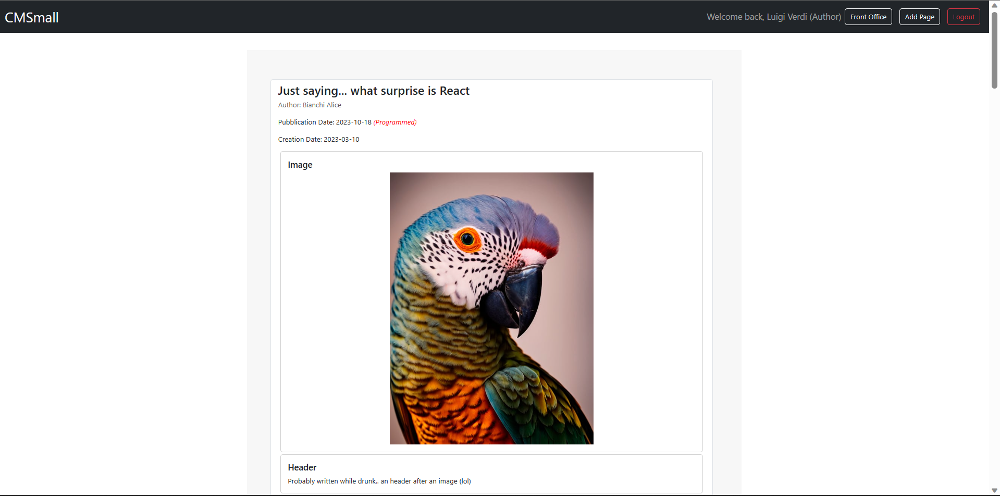
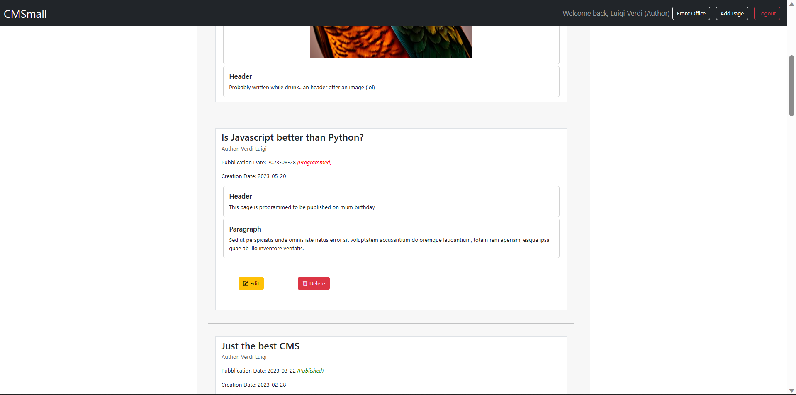

# Exam #1: "cmsmall-jackperlo"
## Student: s317981 PERLO GIACOMO 

## React Client Application Routes

- Route `/`: this route shows the front-office page with the list of published pages; available either for logged in users or guests
- Route `/backOffice`: this route shows the back-office page with the list of all pages(draft, published, programmed), only available for logged in users
- Route `/addPage`: this route leads to the page which allows a logged in user to add a new page
- Route `/editPage/:pageId`: this route leads to the page which allows a logged in user to edit the page with ':pageId' ID
- Route `/editSiteName`: this route allows an admin user (once logged in)  to edit the site name
- Route `/login`: this route shows the login form
- Route `/*`: this route captures every route which is not legal (i.e. the route does not lead to any content) showing an error message

## API Server

- GET `/api/siteName` 
  - This API gets the website's name. 
  - Request body: _None_
  - Response code: `200 OK` (success) or `500 Internal Server Error` (generic error).
  - Response body:  
  ```
    {
      "name": "CMSmall"
    }
  ```

- PUT `/api/siteName` 
  - This API updates the website's name. A cookie with a valid session Id must be provided to check the user who made the request role.
  - Request body: 
  ```
    {
      "name": "CMSmall v2.0"
    }
  ```
  - Response code: `200 OK` (success), `503 Service Unavailable` (db error) or `401 Unauthorized` (the request was made by a user not logged in). If the request body is not valid or the request was made by a non-admin user, `422 Unprocessable Entity` (validation error)
  - Response body:  
  ```
    {}
  ```

- GET `/api/images` 
  - This API gets the id and the url of the images. 
  - Request body: _None_
  - Response code: `200 OK` (success) or `500 Internal Server Error` (generic error) `401 Unauthorized` (requested by a user not logged in).
  - Response body:  
  ```
    [
      { id: 0, name: 'http://localhost:3001/public/images/image1.jpg' },
      ...
    ]
  ```

- GET `/api/authors` 
  - This API gets all the users from which an Admin user could choose when editing/adding a page. A cookie with a valid session Id must be provided to check the user who made the request role
  - Request body: _None_
  - Response code: `200 OK` (success), `500 Internal Server Error` (generic error) or `401 Unauthorized` (the request was made by a user not logged in). If the request was made by a non-admin user `422 Unprocessable Entity` (validation error)
  - Response body:  
  ```
    [
      { id: 2, name: 'Luigi', surname: 'Verdi' },
      ...
    ]
  ```

- GET `/api/pages/published`
  - This API gets all the published (publication date <= today date) pages.
  - Request body: _None_
  - Response code: `200 OK` (success), `500 Internal Server Error` (generic error), `503 Service Unavailable` (db error)
  - Response body:  
  ```
    [
      {
        id: 1,
        title: 'Just the best CMS',
        author_id: 2,
        creation_date: '2023-02-28',
        publication_date: '2023-03-22',
        author_name: 'Luigi',
        author_surname: 'Verdi',
        contents: [
          {
            id: 1,
            header_type: 1,
            header_content: 'This is the first header ever',
            image_type: 0,
            image_content: '',
            paragraph_type: 0,
            paragraph_content: '',
            position: 1,
            page_id: 1
          },
          ...
        ]
      },
      ...
    ]
    ```

- GET `/api/pages` 
  - This API gets all the pages (published, draft, programmed). A cookie with a valid session Id must be provided. 
  - Request body: _None_
  - Response code: `200 OK` (success), `500 Internal Server Error` (generic error), `503 Service Unavailable` (db error) or `401 Unauthorized` (error)
  - Response body:  
  ```
    [
      {
        id: 1,
        title: 'Just the best CMS',
        author_id: 2,
        creation_date: '2023-02-28',
        publication_date: '2023-08-22',
        author_name: 'Luigi',
        author_surname: 'Verdi',
        contents: [
          {
            id: 1,
            header_type: 1,
            header_content: 'This is the first header ever',
            image_type: 0,
            image_content: '',
            paragraph_type: 0,
            paragraph_content: '',
            position: 1,
            page_id: 1
          },
          ...
        ]
      },
      ...
    ]
    ```

- POST `/api/pages` 
  - This API adds a new page with its contents adding the creation date of the page (current date) too. A cookie with a valid session Id must be provided. Depending on the user role (retreived from the session), the author is taken from the body (if the user who made the request is an "Admin") or from the session itself ("Author" users). 
  - Request body:
  ```
  {
    "title":"test add",
    "publication_date":"2023-06-25",
    "contents":[
      {
        "header_type":1,
        "header_content":"Write here your header... :P",
        "image_type":0,
        "image_content":"",
        "paragraph_type":0,
        "paragraph_content":"",
        "position":1,
        "page_id":21
      },
      ...
    ]
  }
  ```
  - Response code: `201 Created` (success), `503 Service Unavailable` (generic error), `401 Unauthorized` (error) or `422 Unprocessable Entity` (validation error)
  - Response body:  
  ```
    { id of the just added page }
  ```

- PUT `/api/pages/:id` 
  - This API updates a page identified by its id. Id in the reqeust body are ignored. A cookie with a valid session Id must be provided. Depending on the user role (retreived from the session), the author is taken from the body (if the user who made the request is an "Admin") or from the session itself ("Author" users). 
  - Request body:
  ```
  {
    "title":"test edit",
    "publication_date":"2023-06-25",
    "contents":[
      {
        "header_type":1,
        "header_content":"Write here your header editing it... :P",
        "image_type":0,
        "image_content":"",
        "paragraph_type":0,
        "paragraph_content":"",
        "position":1,
        "page_id":21
      },
      ...
    ]
  }
  ```
  - Response code: `201 Created` (success), `503 Service Unavailable` (generic error), `401 Unauthorized` (error) or `422 Unprocessable Entity` (validation error. i.e the administrator use an unexisting author)
  - Response body:  
  ```
    { id of the updated page }
  ```

- DELETE `/api/pages/:id` 
  - This API deletes the page identified by its id, and its related content. A cookie with a VALID SESSION ID must be provided. Depending on the SESSION (administrator or not), the administrator can delete pages of which he's not the author. Others users can only delete their pages.
  - Request body: _None_
  - Response code: `200 OK` (success), `503 Service Unavailable` (generic error) or `401 Unauthorized` (error)
  - Response body:  
  ```
    { # pages deleted + # blocks deleted }
  ```

- POST `/api/sessions`
  - this API creates a new session starting from given credentials.
  - Request body: 
    ```
    {
      "username": "admin@mail.com",
      "password": "pwd"
    }
    ```
  - Response body:
    ```
    {
      "id": 1,
      "username": "admin@mail.com",
      "name": "Mario",
      "surname: "Rossi",
      "role": "Admin"
    }
    ```
  - Response code: `200 OK` (success) or `401 Unauthorized` (error) or `500 Internal Server Error` (generic error).


- GET `/api/sessions/current`
  - This API gets the current user session, if it exists.
  - Description: checks if the given session is still valid and return the info about the logged-in user. A cookie with a valid session Id must be provided in order to get the logged-in user info. 
  - Request body: _None_
  - Response body:
    ```
    {
      "id": 1,
      "username": "admin@mail.com",
      "name": "Mario",
      "surname: "Rossi",
      "role": "Admin"
    }
    ```
  - Response code: `201 Created` (success) or `401 Unauthorized` (error).


- DELETE `/api/sessions/current`
  - This API destroys the current session logging out the user.
  - Description: delete the current session. A cookie with a valid session Id must be provided.
  - Request body: _None_
  - Response body: empty object (_{}_)
  - Response code: `200 OK` (success) or `500 Internal Server Error` (generic error).

## Database Tables

- Table `users` - contains all the informations about the users registered in the cms. (i.e. id, email, name, surname, salt, password, role)
- Table `pages` - contains all the pages stored in the cms. For each page this table mantains the following data: id, title, author_id, creation_date, publication_date
- Table `contents` - contains all the contents belonging to a page distinguishing the content in 3 types: header, paragraph, image. For each content this table mantains the following data: id, header_type, header_content, image_type, image_content, paragraph_type, paragraph_content, position(the position of the content in the page), page_id(the page which this content refers), author_id(the author which wrote this content). Only one between header_type, image_type, paragraph_type can be set to 1, the other two fields are equal to 0; this solution allows a content to be classified as header/image/paragraph. The corresponding field(header_content, image_content, paragraph_content) to the one set to 1 contains the real "value" of the content
- Table `cms_name` - contains a unique field(name) which is the name of the cms (set by the admin). This solution allows to make any changes of the name persistent
- Table `images` - contains the list of images stored on the server. (i.e. id, name(which is the url where retreive the image)) 

## Main React Components

- `API`          (in `API.js`): this component contains all the API calls
- `CustomNavbar` (in `Navbar.jsx`): this is the responsive navbar used to log in/log out and "navigate" through the site. It shows the site name too.
- `DefaultRoute` (in `DefaultRoute.jsx`): this is the component which shows an error when a not legal route is requested by the user
- `LoginForm`    (in `LoginForm.jsx`): this is the form used to log in 
- `Office`  (in `Office.jsx`): this is the component which implements either the Front-Office or the Back-Office, showing all/only the published pages stored in the cms (front-office for guests and logged in users, back-office only for logged in users allowing them to edit/delete pages too, according to their role and page ownership)
- `PageManagement` (in `PageManagement.jsx`): this component manages the possibility to either edit an existing page or add a new page
- `Page`         (in `Page.jsx`): this component implements the page stored in the cms written by an author. This component is used in the Front Office and Back Office to show the list of pages
- `Content`      (in `Content.jsx`): this component represents either an image, or a paragraph or an header of the corresponding page.
- `EditSiteName` (in `EditSiteName.jsx`): this component manage the possibility for the 'Admin' users to edit the site name

## Screenshot

(1) Screenshot listing all pages:


(2) Screenshot listing all pages:


Screenshot showing add page:


## Users Credentials

- admin@mail.com, pwd (admin user with 0 pages created)
- author1@mail.com, pwd (author with 4 pages created. 2 published, 1 programmed, 1 draft)
- author2@mail.com, pwd (author with 2 pages created. 1 programmed, 1 draft)
- author3@mail.com, pwd (author with 0 pages created)

